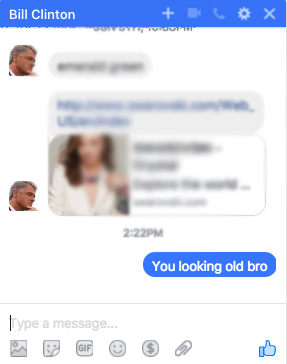

#Facebook Messenger Send for Alfred 3

by Gilgamesh Skytrooper

*Most of the scripting is completely taken from henrik's Send on Messenger. But this packages the simple script into a usable workflow*


A primative workflow to send a facebook message over a node.js script

Have you missed using Facebook Messeges from your Messeges app? Although lacking complete features, this workflow will allow you to send a message anyone on Facebook (as long as you get the name right).


##Installation

*Alfred 3 and Powerpack is required*

*node.js and npm are required (easiest to do it on homebrew)*

1) - Download "[FB Messeges Sender.alfredworkflow](https://github.com/gilgameshskytrooper/FB-Messeges-Sender-Alfred-Workflow/FBMessegesSender)" extension.

2) - Double click the downloaded "FBMessegesSender" file to install, or drag and drop in Alfred Preferences > Workflows > Import

3) Create the file ~/.facebook-auth containing your login email and password in the format:
    ```bash
    username@example.com:mypassword.
    ```

4) Open the workflow directory from Alfred Preferences > Open in Finder
A) Copy the path by CMD-N (which will open up a new Finder window), CMD-Shift-G (which allows you to drag and drop a diretory path to get the full path).
    *note, sometimes there is already text in the CMD-Shift-G text field, so you want to remove all the text before pasting in the workflow's path or else when you paste the directory, it will paste in the middle of the old text, and create an invalid path*
B) Highlight the new path, and copy into your clipboard. (CMD-A), (CMD-C)
C) Open a new Terminal or iTerm window and change directories into the path you just copied
    ```bash
    cd PATH_TO_WORKFLOW
    ```
D) Install Dependencies
    ```bash
      npm install
    ```


## Commands

- 'fb:'' `<string>`
- ''     `<string>`

Keyword "fb:" + "FIRSTNAME LASTNAME" + Return


"Messege Content" Return


Wallah, it sent




## Some Nuances

Because this does not actually query your Contacts for a specific name, if you enter a the name incorrectly Messenger Send will either not send, or it will send to some random person (the latter of which happened to me a few times, and its embarrasing to say the least).

Furthermore, you need to store your Facebook credentials in a plain text file to authenticate. Therefore, for security minded people, this workflow is not for your.

## Further Development

I think this workflow is on a good start, but it definitely could use some features such as querying from your contacts to get the exact name to send the message, or to incorporate some type of notification feature from your friends messeging you back. At the same time, I made a super ghetto fix in the workflow builder to replace the contact field with a blank space for the message content field, so if someone could help me sort that out, it would be much appreciated.

As I am a coding n00b, I would love some help in making this a full fledged FB Messeges Integration Workflow which doesn't rely on the Jabber IM prolocols.

I welcome further development, and will do my best to update this workflow as necessary.

#Thanks for your time